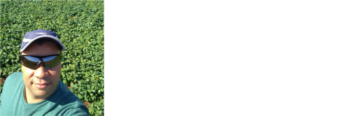
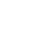

     

## Formação Acadêmica

**2021 -**  
Mestrado em Biologia Animal  
Universidade Federal do Rio Grande do Sul - UFRGS  
Porto Alegre, Brasil  
Orientador: Lucas A. Kamisnk  
Co-orientador: Rafael N. Meireles

**2019 - 2020**  
Aluno Especial - Bacharelado em Agronomia.  
Universidade Estadual do Rio Grande do Sul, UERGS  
São Luiz Gonzaga-RS, Brasil.  

**2019 - 2019**  
Aperf. em Manejo e Fertilidade do Solo 
SENAR – Serviço Nacional de Aprendizagem Rural  
SENAR - Brasil  

**2019 - 2019**  
Aperf. e Capacitação no Cadastro Ambiental Rural - CAR  
Universidade Federal de Viçosa - UFV  
Vicosa - MG, Brasil  

**2007 - 2008**
Esp. em Gestão Ambiental - Ênfase em Recursos Hídricos  
Universidade Regional Integrada do Alto Uruguai e das Missões - URI  
Santiago - RS, Brasil  
  
**2003 - 2007**  
Graduação em Ciências Biólogicas
Universidade Regional Integrada do Alto Uruguai e das Missões - URI  
Santo Ângelo - RS, Brasil 

*Mais detalhes, clique e acesse:*  
 

