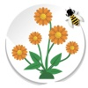

**Alguns dos meu projetos em Andamento**  

O projeto **Abelhas Missioneiras** - considerado macro - subdivide-se em outros dois: **Abelhas Urbanas** e **Flora Apícola**, mas, todos versam sobre Abelhas-Sem-Ferrão (ASF) no estado do Rio Grande do Sul e concentram-se na grande área da Ecologia, Biologia da Polinização e Conservação da Biodiversidade.  

>Os projetos aqui relacionados são uma pesquisa autêntica, portanto, real. O autor está apenas a utilizar de novas TICs para "fazer ciência". O uso destas tecnologias permitem alcançar níveis muito mais altos de participação, colaboração e interação, além de contribuir na construção da “Ciência Cidadã”, a qual visa fortalecer as relações entre cientistas e a comunidade.

*Para acesar a página do projeto, clique na imagem referente a ele*

  
O projeto **Abelhas Missioneiras** trata incialmente da preservação de recursos naturais (aninais e vegetais) já que alguns podem estar em risco de extinção. Neste momento a coleta de dados esta direcionada à Região das Missões (Noroeste do Rio Grande do Sul). O conjunto destas informações aqui adquiridas e compiladas ajudaram a compreender o manejo e produção de diversas plantas, diagnosticará a situação e ocorrências de espécies de abelhas nativas do Rio Grande do Sul, fomentará novos estudos/projetos de conservação, fornecerá dados para o planejamento mais equitativo para o desenvolvimento sustentável, o qual aliado a uma maior diversidade genética promove um maior alcance dos serviços ecossistêmicos associados a este grupo de insetos. 

  
 
O projeto **Abelhas Urbanas** *(Urban Bees)* objetiva o registro fotográfico das abelhas indígenas sem ferrão (dos ninhos e dos espécimes) das duas grandes tribos: a Trigonini e a Meliponini em municípios ao Sul do Brasil encontradas no perímetro urbano. Esta iniciativa visa, além da disseminação do conhecimento acerca destas espécies, a possibilidade de uso destes insetos de forma racional (meliponicultura), práticas de Ecopedagogia e Educação Ambiental.  

  

O projeto **Flora Apícola** pretende relacionar o conhecimento da fonte de alimento das abelhas e as espécies nativas/exóticas e cultivadas/espontâneas nos municípios do Sul do Brasil. Consideramos este trabalho um pilar para o entendimento da biologia, ecologia, distribuição e sazonalidade da oferta de recursos. O que acaba contribuindo com a sua preservação e manutenção da biodiversidade.  
  
